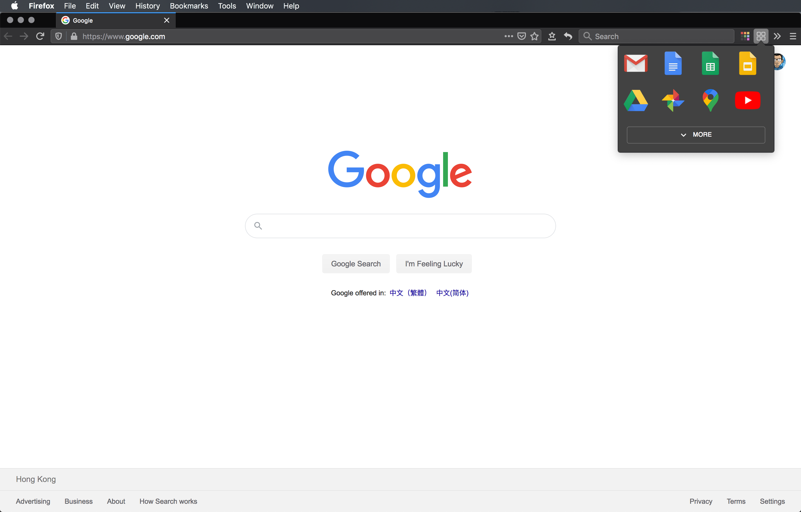
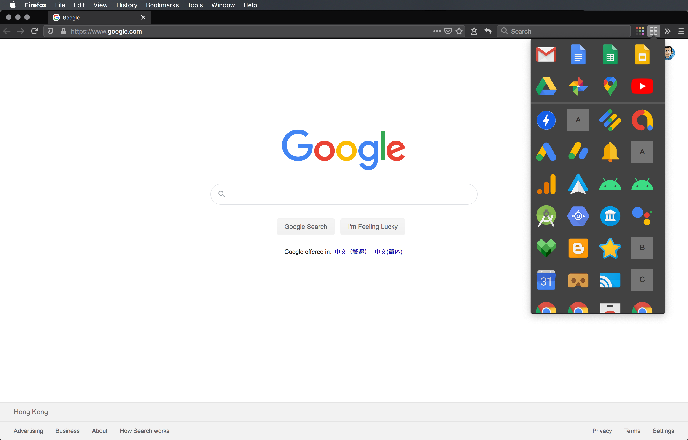
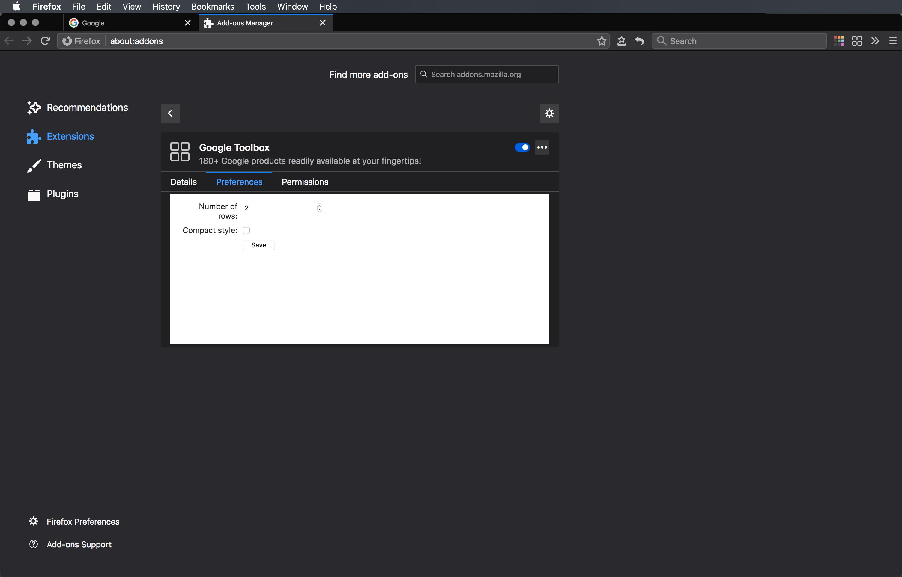

# Google Toolbox WebExtension
180+ Google products readily available at your fingertips!

| Category      | Measurement                                                                                                                                                                                                                                                                                                                                                                                                                                                                                                                                                                                                                                         |
|---------------|-----------------------------------------------------------------------------------------------------------------------------------------------------------------------------------------------------------------------------------------------------------------------------------------------------------------------------------------------------------------------------------------------------------------------------------------------------------------------------------------------------------------------------------------------------------------------------------------------------------------------------------------------------|
| Pipeline      | [](https://circleci.com/gh/ayltai/google-toolbox-webextension)                                                                                                                                                                                                                                                                                                                                                                                                                                                                  |
| Quality       | [](https://app.codacy.com/app/AlanTai/google-toolbox-webextension/dashboard) [](https://sonarcloud.io/dashboard?id=ayltai_google-toolbox-webextension) [](https://sonarcloud.io/dashboard?id=ayltai_google-toolbox-webextension)            |
| Coverage      | [](https://codecov.io/gh/ayltai/google-toolbox-webextension) [](https://sonarcloud.io/dashboard?id=ayltai_google-toolbox-webextension)                                                                                                                                                                                                                                                                     |
| Rating        | [](https://sonarcloud.io/dashboard?id=ayltai_google-toolbox-webextension) [](https://sonarcloud.io/dashboard?id=ayltai_google-toolbox-webextension) [](https://sonarcloud.io/dashboard?id=ayltai_google-toolbox-webextension) |
| Security      | [](https://sonarcloud.io/dashboard?id=ayltai_google-toolbox-webextension) [](https://sonarcloud.io/dashboard?id=ayltai_google-toolbox-webextension)                                                                                                                                                                                                                     |
| Miscellaneous |  [](https://github.com/ayltai/google-toolbox-webextension/releases) [](https://github.com/ayltai/google-toolbox-webextension/blob/master/LICENSE)                                                                                                                                                                                                                                  |

A Firefox/Chrome/Edge extension that provides a customizable list of shortcuts to 186 Google services.

Available at: https://addons.mozilla.org/addon/google-toolbox/

[](https://buymeacoff.ee/ayltai)







## Features
* Shows a list of shortcuts to 186 Google services
* Fully customizable drag-and-drop shortcut ordering
* Support two styles: compact and cozy

## Getting started
You can build this project using macOS or Linux.

### Install
1. Install [NodeJS](https://nodejs.org)
2. Install dependencies
   ```sh
   npm i -D
   ```

### Build
```sh
npm run build
```

### Run
```sh
npm start
```

## Acknowledgements
This software is made with the support of open source projects:
* [NodeJS](https://nodejs.org)
* [React](https://github.com/facebook/react)
* [Create React App](https://github.com/facebook/create-react-app)
* [Material UI](https://material-ui.com)
* [React Sortable HOC](https://github.com/clauderic/react-sortable-hoc)
* [ESLint](https://eslint.org)
* [Stylelint](https://stylelint.io)
* [Enzyme](https://airbnb.io/enzyme)
* [web-ext](https://github.com/mozilla/web-ext)

... and closed source services:
* [CircleCI](https://circleci.com)
* [SonarCloud](https://sonarcloud.io)
